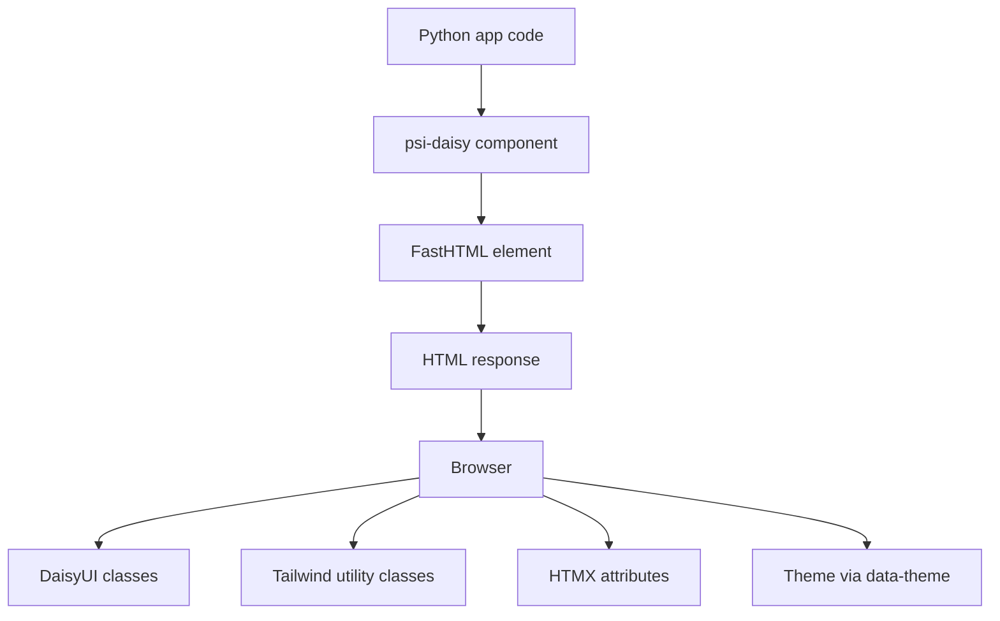
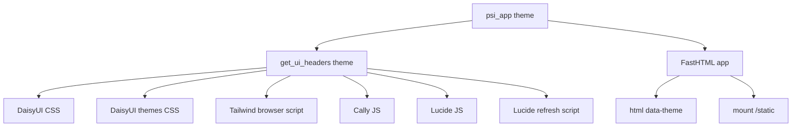
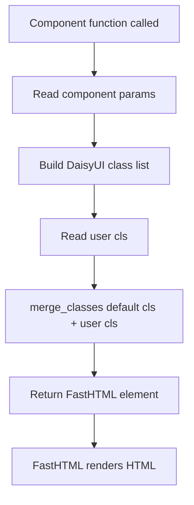
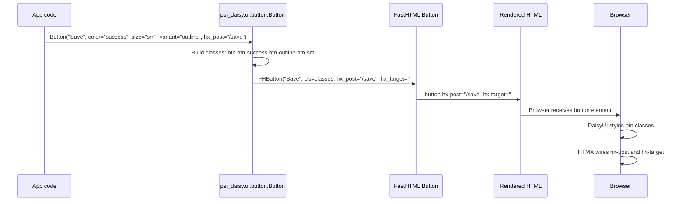
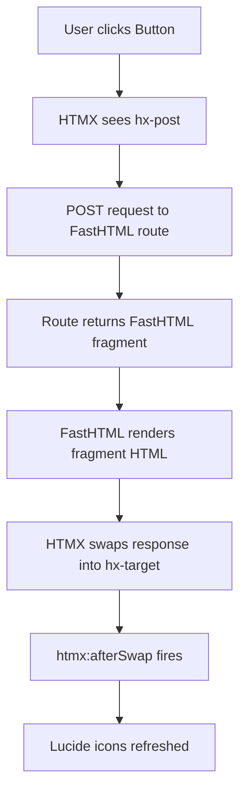
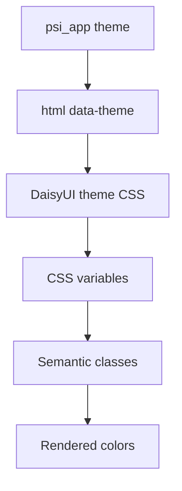
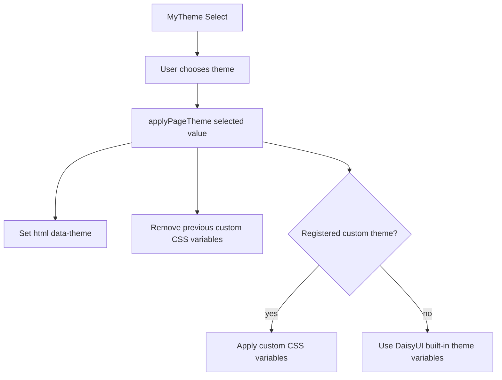
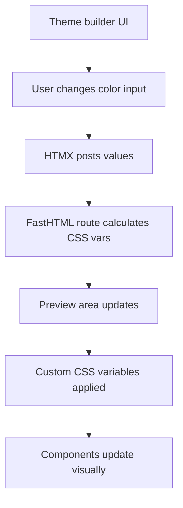
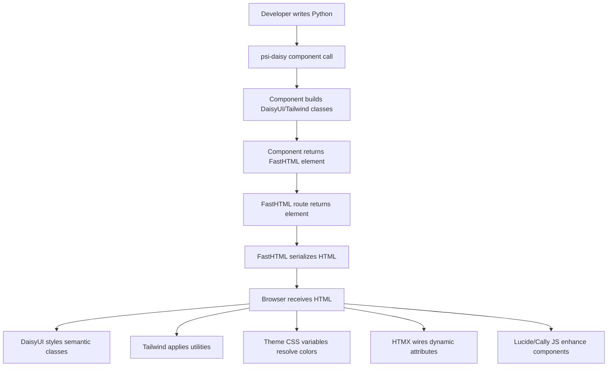
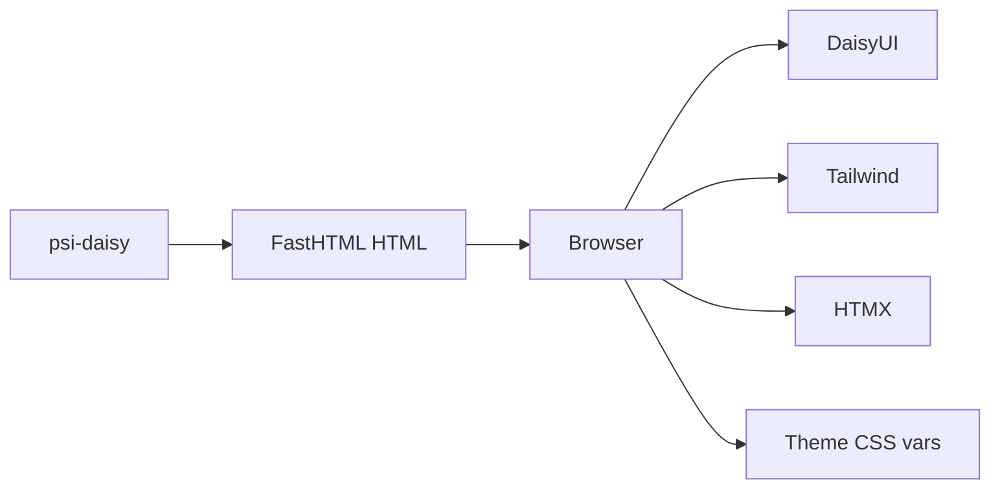

# Component Rendering Flow

This document explains how a `psi-daisy` component becomes rendered HTML in the browser, and how `psi-daisy`, FastHTML, HTMX, DaisyUI, Tailwind, themes, and CSS work together.

`psi-daisy` is a Python component layer for building DaisyUI-styled FastHTML apps. A `psi-daisy` component is a Python function that returns a FastHTML element with DaisyUI and Tailwind classes applied.

---

## Big Picture



The main roles are:

| Layer | Role |
| --- | --- |
| `psi-daisy` | Provides Python component functions like `Button`, `Card`, `Alert`, `ThemeController` |
| FastHTML | Converts Python element objects into HTML |
| DaisyUI | Provides semantic component class names like `btn`, `card`, `alert`, `modal` |
| Tailwind | Provides utility classes like `p-6`, `gap-4`, `text-primary`, `bg-base-200` |
| HTMX | Handles dynamic browser interactions through attributes like `hx-post`, `hx-target`, `hx-swap-oob` |
| Themes | Controlled through DaisyUI’s `data-theme` attribute and optional custom CSS variables |

---

## App Setup

The main app factory is `psi_app()` in `psi_daisy/app.py`.

It creates a FastHTML app, loads the UI headers, sets the page theme, and mounts the package static directory.

```python
from psi_daisy import psi_app

app = psi_app(theme="light")
```

Internally, `psi_app()` does three important things:

1. Calls `get_ui_headers(theme)`
2. Creates a FastHTML app with `data-theme`
3. Mounts `/static`

Conceptually:



The theme is applied at the HTML root using:

```python
htmlkw={"data-theme": theme}
```

So the rendered page has a root-level DaisyUI theme context, for example:

```html
<html data-theme="light">
```

DaisyUI then uses that `data-theme` value to decide which CSS variables to apply.

---

## UI Headers

The UI headers are created by `get_ui_headers()` in `psi_daisy/ui/css.py`.

The headers include:

- DaisyUI v5 CSS
- DaisyUI themes CSS
- Tailwind browser v4
- Cally JS
- Lucide JS
- A small Lucide refresh script

The Lucide script refreshes icons on initial page load and after HTMX swaps:

```javascript
document.addEventListener('DOMContentLoaded', () => lucide.createIcons());
document.addEventListener('htmx:afterSwap', () => lucide.createIcons());
```

That matters because HTMX can replace part of the page after initial load. If the swapped-in HTML contains Lucide icons, they need to be reprocessed.

Some custom components require additional JavaScript headers. These are **not included automatically** by `psi_app()`:

| Component | Header helper |
| --- | --- |
| `MyDate` | `get_date_picker_headers()` |
| `MyTime` | `get_time_picker_headers()` |
| `MyDatetime` | `get_datetime_picker_headers()` |
| `MyColor` | `get_color_picker_headers()` |
| `MyTheme` | `get_theme_picker_headers()` |

Pass the required list through `hdrs` when constructing the app:

```python
app, rt = psi_app(hdrs=get_theme_picker_headers())
```

For several picker types, concatenate the lists:

```python
app, rt = psi_app(
    hdrs=get_datetime_picker_headers() + get_theme_picker_headers())
```

---

## Component Structure

Most `psi-daisy` components follow the same pattern:



For example, `Card` in `psi_daisy/ui/card.py` wraps FastHTML’s `Div`:

```python
from fasthtml.common import Div
from ..utils import merge_classes

def Card(*children, **kw):
    """DaisyUI card component."""
    user_cls = kw.pop("cls", None)
    return Div(*children, cls=merge_classes("card bg-base-100 shadow-xl", user_cls), **kw)
```

So this:

```python
Card(H2("Hello"), P("Card body"), cls="p-6 border")
```

renders as a FastHTML `Div` with the default card classes plus the user classes:

```html
<div class="card bg-base-100 shadow-xl p-6 border">
    ...
</div>
```

The default classes come from `psi-daisy`; the extra layout/styling classes come from the caller.

---

## Class Merging

`psi-daisy` uses `merge_classes()` from `psi_daisy/utils`.

The behavior is intentionally simple: component defaults are combined with the user-provided `cls`.

For example:

```python
merge_classes("card bg-base-100 shadow-xl", "p-6 border")
```

produces:

```text
card bg-base-100 shadow-xl p-6 border
```

This means:

- component defaults remain present
- users can add Tailwind utilities
- users can add DaisyUI modifiers
- classes are not automatically deduplicated
- conflicting classes are left for Tailwind/DaisyUI/CSS ordering to resolve

---

## Step-by-Step: Rendering a Button

`Button` is a `psi-daisy` wrapper around FastHTML’s `Button`.

The direct import path is:

```python
from psi_daisy.ui.button import Button
```

A simple button call:

```python
Button("Save", color="success", size="sm", variant="outline", hx_post="/save", hx_target="#out")
```

renders to:

```html
<button hx-post="/save" hx-target="#out" class="btn btn-success btn-outline btn-sm">Save</button>
```

Step by step:



The important detail is that HTMX attributes pass through `**kw`.

In Python/FastHTML, the attribute is written as:

```python
hx_post="/save"
```

FastHTML renders it as:

```html
hx-post="/save"
```

So `psi-daisy` does not need special HTMX handling in the component. It passes the keyword arguments through to FastHTML, and FastHTML renders the proper HTML attributes.

---

## Button Rendering Layers

For this call:

```python
Button("Save", color="success", size="sm", variant="outline", hx_post="/save", hx_target="#out")
```

the rendered HTML is:

```html
<button hx-post="/save" hx-target="#out" class="btn btn-success btn-outline btn-sm">Save</button>
```

Each piece has a role:

| HTML piece | Source | Meaning |
| --- | --- | --- |
| `<button>` | FastHTML | The actual HTML element |
| `Save` | App code | Button label |
| `btn` | `psi-daisy` / DaisyUI | Base DaisyUI button class |
| `btn-success` | `color="success"` | DaisyUI semantic color |
| `btn-outline` | `variant="outline"` | DaisyUI button variant |
| `btn-sm` | `size="sm"` | DaisyUI button size |
| `hx-post="/save"` | user kwarg passed through FastHTML | HTMX request target |
| `hx-target="#out"` | user kwarg passed through FastHTML | HTMX swap target |

---

## FastHTML’s Role

FastHTML is the Python-to-HTML layer.

`psi-daisy` components return FastHTML element objects. FastHTML then serializes those objects into HTML.

For example:

```python
Button("Save", color="success")
```

becomes a FastHTML button element, and FastHTML renders it as HTML.

FastHTML also converts Python-friendly attribute names into HTML-friendly names:

| Python | HTML |
| --- | --- |
| `cls` | `class` |
| `hx_post` | `hx-post` |
| `hx_target` | `hx-target` |
| `data_theme` | `data-theme` |
| `stroke_width` | `stroke-width` |

This is why `psi-daisy` components can accept normal FastHTML keyword arguments and pass them through.

---

## HTMX’s Role

HTMX is used for dynamic interactions.

The example apps use HTMX attributes such as:

```python
hx_post="/render"
hx_target="#display"
hx_include="#comp-sel,[name]"
hx_swap_oob="true"
hx_trigger="change"
```

For example, a component selector button can post form state to a route and swap the result into a display area:

```python
Button("View", hx_post="/render", hx_target="#display", hx_include="#comp-sel,[name]")
```

Rendering flow:



`psi-daisy` does not replace HTMX. It makes it convenient to put HTMX attributes on styled DaisyUI components.

---

## DaisyUI’s Role

DaisyUI provides semantic component classes.

Examples:

```text
btn
btn-primary
btn-outline
card
alert
modal
dropdown
navbar
tabs
```

`psi-daisy` components generate these classes from Python parameters.

For example:

```python
Button("Save", color="success", variant="outline", size="sm")
```

produces:

```text
btn btn-success btn-outline btn-sm
```

DaisyUI then applies the component styling in the browser.

---

## Tailwind’s Role

Tailwind provides utility classes.

Examples:

```text
p-6
border
flex
gap-4
min-h-screen
bg-base-200
text-primary
rounded-lg
shadow-xl
```

`psi-daisy` uses Tailwind in two ways:

1. Component defaults can include Tailwind utilities.
2. Users can pass extra utilities with `cls`.

Example:

```python
Card(
    H2("Hello psi-daisy"),
    P("A DaisyUI component library for FastHTML."),
    Button("Click me", color="primary"),
    cls="p-6 border")
```

The `Card` component supplies:

```text
card bg-base-100 shadow-xl
```

The caller adds:

```text
p-6 border
```

The final class list is:

```text
card bg-base-100 shadow-xl p-6 border
```

---

## Themes

DaisyUI themes are controlled by the `data-theme` attribute.

`psi_app(theme="light")` sets the initial theme:

```python
app = psi_app(theme="light")
```

That becomes:

```html
<html data-theme="light">
```

DaisyUI then applies the matching CSS variables.

Theme flow:



For example:

```text
bg-base-100
bg-base-200
text-base-content
btn-primary
text-primary
```

depend on the active theme.

The same class can look different under different themes because DaisyUI changes the underlying CSS variables.

---

## ThemeController

`ThemeController` in `psi_daisy/ui/theme_controller.py` returns a checkbox with DaisyUI’s `theme-controller` class that allows you to toggle between the current and another theme:

```python
ThemeController("dark")
```

It renders an input conceptually like:

```html
<input type="checkbox" value="dark" class="theme-controller">
```

DaisyUI uses that pattern to toggle themes.

`psi-daisy` also has custom theme support in `psi_daisy/themes.py`, including helpers for:

- reading DaisyUI theme variables
- saving custom theme CSS
- registering custom themes
- applying a theme by setting `data-theme`
- applying custom CSS variables to `document.documentElement`

The client-side theme function does the key browser work:

```javascript
document.documentElement.setAttribute('data-theme', name)
```

and then applies or removes custom CSS variables.

---

## MyTheme

`MyTheme` in `psi_daisy/ui/my_theme.py` renders a `Select` for choosing a theme from DaisyUI's built-in themes and registered custom themes:

```python
from psi_daisy.ui import MyTheme, get_theme_picker_headers

app, rt = psi_app(hdrs=get_theme_picker_headers())

MyTheme(current="light", name="site_theme", id="site-theme")
```

The component renders options from `BUILTIN_THEMES` and `registered_themes()`. Its change handler calls:

```javascript
applyPageTheme(this.value)
```

That browser function is supplied by `get_theme_picker_headers()`, not by the default `psi_app()` headers. The helper also serializes registered custom-theme variables into the page.



Without `get_theme_picker_headers()`, the select can render but `applyPageTheme()` is unavailable, so changing the selection cannot apply the page theme correctly.

---

## Custom Theme Variables

`themes.py` works with DaisyUI CSS variables such as:

```text
color-base-100
color-base-200
color-base-300
color-base-content
color-primary
color-primary-content
color-secondary
color-secondary-content
color-accent
color-accent-content
color-neutral
color-neutral-content
color-info
color-info-content
color-success
color-success-content
color-warning
color-warning-content
color-error
color-error-content
```

The theme builder example uses HTMX to preview, seed, import, and save theme values.

Conceptually:



---

## CSS Loading

CSS and JS URLs are configured in `psi_daisy/config.py`.

The current config uses:

| Constant | Purpose |
| --- | --- |
| `TAILWIND_CSS_PATH` | Tailwind browser v4 |
| `DAISYUI_CSS_PATH` | DaisyUI v5 |
| `DAISYUI_THEMES_CSS_PATH` | DaisyUI v5 themes |
| `CALLY_JS_PATH` | Cally calendar support |
| `LUCIDE_JS_PATH` | Lucide icon support |
| `STATIC_DIR` | Local package static directory |
| `THEMES_DIR` | Local custom theme CSS directory |

`psi_app()` mounts `STATIC_DIR` at:

```text
/static
```

So package static assets and saved themes can be served by the app.

---

## Icons

`MyIcon` in `psi_daisy/ui/my_icon.py` renders a Lucide icon placeholder using an `<i>` element with `data_lucide`.

For example:

```python
MyIcon("search", color="primary")
```

returns an element with:

```html
<i data-lucide="search" class="text-primary"></i>
```

Lucide JS then replaces that placeholder with the actual SVG icon in the browser.

Because HTMX can swap in new icon placeholders after the page has loaded, `get_ui_headers()` installs a listener for:

```text
htmx:afterSwap
```

and calls:

```javascript
lucide.createIcons()
```

---

## Full Rendering Flow



---

## Example: Small Page

```python
from fasthtml.common import *
from psi_daisy.ui.button import Button
from psi_daisy.ui.card import Card

app, rt = psi_app()

@rt("/")
def get(): return Div(
    Card(
        H2("Hello psi-daisy"),
        P("A DaisyUI component library for FastHTML."),
        Button("Click me", color="primary"),
        cls="p-6 border"),
    cls="min-h-screen bg-base-200 p-8")
```

The important part is that `Button` and `Card` provide DaisyUI component defaults, while the page code adds layout utilities like:

```text
p-6
border
min-h-screen
bg-base-200
p-8
```

---

## Example: HTMX Button

```python
from psi_daisy.ui.button import Button

Button("Save", color="success", size="sm", variant="outline", hx_post="/save", hx_target="#out")
```

renders as:

```html
<button hx-post="/save" hx-target="#out" class="btn btn-success btn-outline btn-sm">Save</button>
```

This shows the full stack in one element:

| Part | System |
| --- | --- |
| `Button(...)` | `psi-daisy` |
| `<button>` | FastHTML |
| `btn btn-success btn-outline btn-sm` | DaisyUI |
| `hx-post`, `hx-target` | HTMX |
| final styling | DaisyUI + Tailwind + theme CSS variables |

---

## CSS Modes

The above diagrams use the *default* CSS mode, where psi-daisy loads DaisyUI/Tailwind from CDN-style URLs:

```python
app = psi_app(theme="light")
```

There is a *static* CSS mode, where psi-daisy loads DaisyUI/Tailwind from a local packaged static CSS bundle instead:

```python
app = psi_app(theme="light", css="static")
```

Conceptually:

```mermaid
flowchart TD
    A[psi_app] --> B{css mode}
    B -->|cdn| C[DaisyUI CDN CSS]
    B -->|cdn| D[DaisyUI themes CDN CSS]
    B -->|cdn| E[Tailwind browser script]
    B -->|static| F[/static/ui.css]
    C --> G[Browser styles components]
    D --> G
    E --> G
    F --> G
```

See `docs/Static_CSS_Bundle.md` for details.

---

## Mental Model

A `psi-daisy` component does not directly paint pixels.

It builds a FastHTML element with the right classes and attributes.

The browser then applies:

1. DaisyUI component CSS
2. Tailwind utility CSS
3. DaisyUI theme variables
4. HTMX behavior
5. Optional JavaScript enhancement such as Lucide icons



So when debugging rendering, check in this order:

1. Did the Python component return the expected FastHTML element?
2. Did FastHTML render the expected HTML?
3. Are the expected classes present?
4. Are the expected `hx-*` attributes present?
5. Is the correct `data-theme` set?
6. Are DaisyUI, Tailwind, and theme CSS loaded?
7. If using icons or swapped content, did the relevant JS run after load or HTMX swap?
