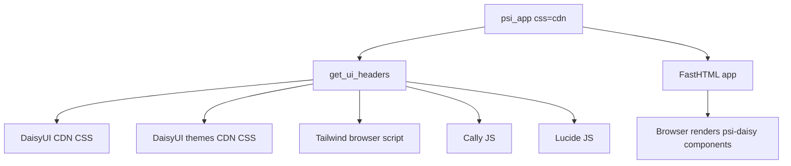

# Static CSS Bundle

`psi-daisy` can load DaisyUI/Tailwind styles in two ways:

1. **CDN mode** — the default, simple development mode.
2. **Static bundle mode** — a local `/static/ui.css` bundle served by the app.

CDN mode is easiest while building and testing. Static bundle mode is useful for packaged apps, offline use, demos with predictable styling, and avoiding runtime CSS CDN dependencies.

---

## Current App Setup

The CSS and JS paths are configured in `psi_daisy/config.py`.

```python
TAILWIND_CSS_PATH = "https://cdn.jsdelivr.net/npm/@tailwindcss/browser@4"
DAISYUI_CSS_PATH = "https://cdn.jsdelivr.net/npm/daisyui@5"
DAISYUI_THEMES_CSS_PATH = "https://cdn.jsdelivr.net/npm/daisyui@5/themes.css"
STATIC_UI_CSS_PATH = "/static/ui.css"

CALLY_JS_PATH = "https://unpkg.com/cally"
LUCIDE_JS_PATH = "https://unpkg.com/lucide@latest/dist/umd/lucide.js"
```

`psi_daisy/ui/css.py` exposes `get_ui_headers(theme="light", css="cdn")`.

In CDN mode it loads:

- DaisyUI CDN CSS
- DaisyUI themes CDN CSS
- Tailwind browser v4
- Cally JS
- Lucide JS
- a Lucide refresh script for initial load and HTMX swaps

In static mode it loads:

- `/static/ui.css`
- Cally JS
- Lucide JS
- the same Lucide refresh script

The app factory in `psi_daisy/app.py` passes the CSS mode through:

```python
def psi_app(*, theme: str = "light", css: str = "cdn", hdrs=None, **kw):
    "Create a FastHTML app with the UI CSS loaded."
    hdrs = get_ui_headers(theme, css) + (hdrs or [])
    app = fast_app(hdrs=hdrs, htmlkw={"data-theme": theme}, **kw)
    app.mount("/static", StaticFiles(directory=STATIC_DIR), name="static")
    return app
```

Because `psi_app()` mounts `STATIC_DIR` at `/static`, the packaged bundle lives at:

```text
psi_daisy/static/ui.css
```

and is served as:

```text
/static/ui.css
```

---

## CDN Mode

CDN mode is the default:

```python
from psi_daisy import psi_app

app = psi_app(theme="light")
```

This is equivalent to:

```python
app = psi_app(theme="light", css="cdn")
```



Use CDN mode when you want the least setup and the broadest DaisyUI/Tailwind behavior during development.

---

## Static Bundle Mode

Static bundle mode uses the local packaged CSS file:

```python
from psi_daisy import psi_app

app = psi_app(theme="light", css="static")
```

```mermaid
flowchart TD
    A[psi_app css=static] --> B[get_ui_headers]
    B --> C[/static/ui.css]
    B --> D[Cally JS]
    B --> E[Lucide JS]
    A --> F[FastHTML app]
    F --> G[mount psi_daisy/static at /static]
    G --> H[Browser loads local CSS bundle]
```

The Python components do not change.

For example:

```python
Button("Save", color="success", size="sm", variant="outline")
```

still renders DaisyUI classes such as:

```html
<button class="btn btn-success btn-outline btn-sm">Save</button>
```

Only the source of the CSS changes.

---

## Using Static CSS in an App

A developer can switch an app to static CSS by passing `css="static"` to `psi_app()`.

```python
from fasthtml.common import *
from psi_daisy import psi_app
from psi_daisy.ui import *

app = psi_app(theme="light", css="static")
rt = app.route

@rt("/")
def get(): return Div(
    Card(
        H2("Static CSS Bundle"),
        P("This page is using psi-daisy's bundled /static/ui.css file."),
        Button("Static bundle active", color="success", variant="outline"),
        cls="p-6 border"),
    cls="min-h-screen bg-base-200 p-8")
```

In a notebook environment:

```python
from fasthtml.jupyter import JupyUvi
server = JupyUvi(app)
```

---

## Example: Theme Selector with Static CSS

The `examples/theme_selector.py` demo creates its app with `psi_app()`.

CDN mode:

```python
app = psi_app(hdrs=get_date_picker_headers() + get_time_picker_headers() + get_datetime_picker_headers() + get_color_picker_headers())
```

Static bundle mode:

```python
app = psi_app(css="static", hdrs=get_date_picker_headers() + get_time_picker_headers() + get_datetime_picker_headers() + get_color_picker_headers())
```

Then the notebook runner can stay the same:

```python
import importlib
from fasthtml.jupyter import JupyUvi
import examples.theme_selector as demo

importlib.reload(demo)
app = demo.app
server = JupyUvi(app)
```

The important point is that `css="static"` must be passed where `psi_app()` is called. Once `demo.app` already exists, the headers have already been created.

---

## Building the Bundle

The bundle is built with Tailwind v4 and DaisyUI v5.

Set up the local build folder:

```bash
cd /app/data/psi-daisy
mkdir -p styles/daisyui
cd styles/daisyui
npm init -y
npm install --save-dev tailwindcss @tailwindcss/cli daisyui
```

Create `styles/daisyui/input.css`:

```css
@import "tailwindcss";

@plugin "daisyui" {
  themes: all;
}

@source "../../psi_daisy/**/*.py";
@source "../../examples/**/*.py";

@source inline("btn btn-primary btn-secondary btn-accent btn-info btn-success btn-warning btn-error btn-neutral");
@source inline("btn-outline btn-soft btn-dash btn-link btn-ghost btn-xs btn-sm btn-lg");
@source inline("select select-primary select-secondary select-accent select-info select-success select-warning select-error select-neutral select-ghost select-xs select-sm select-lg");
@source inline("radio radio-primary radio-secondary radio-accent radio-info radio-success radio-warning radio-error radio-xs radio-sm radio-lg");
@source inline("checkbox checkbox-primary checkbox-secondary checkbox-accent checkbox-info checkbox-success checkbox-warning checkbox-error checkbox-xs checkbox-sm checkbox-lg");
@source inline("badge badge-primary badge-secondary badge-accent badge-info badge-success badge-warning badge-error badge-neutral badge-outline badge-soft badge-dash badge-ghost");
@source inline("alert alert-primary alert-secondary alert-accent alert-info alert-success alert-warning alert-error alert-soft alert-outline alert-dash");
```

Build the bundle:

```bash
cd /app/data/psi-daisy/styles/daisyui
npx @tailwindcss/cli -i input.css -o ../../psi_daisy/static/ui.css --minify
```

This writes:

```text
/app/data/psi-daisy/psi_daisy/static/ui.css
```

which is served by the app as:

```text
/static/ui.css
```

---

## Why the Inline Sources Are Needed

Tailwind only includes classes it can detect during the build.

Many `psi-daisy` classes are built dynamically from Python parameters. For example, `Button` can produce classes like:

```text
btn-primary
btn-success
btn-outline
btn-sm
```

but the source may contain dynamic Python such as:

```python
f"btn-{color}"
```

Tailwind cannot infer every possible value of `color`, `variant`, or `size` from that expression.

The `@source inline(...)` lines explicitly tell Tailwind to include those generated classes in the bundle.

Without these safelisted classes, a static bundle may load correctly but components can appear partially styled or unstyled.

---

## Verifying the Bundle

After rebuilding, check that expected themes and dynamic classes are present:

```python
from pathlib import Path

css = Path("/app/data/psi-daisy/psi_daisy/static/ui.css").read_text(errors="ignore")
themes = "light dark cupcake bumblebee emerald corporate synthwave retro cyberpunk valentine aqua luxury dracula".split()
[(o, f"[data-theme={o}]" in css or f'[data-theme="{o}"]' in css) for o in themes]
```

Check common dynamic classes:

```python
classes = "btn-primary btn-secondary btn-accent btn-info btn-success btn-warning btn-error btn-outline btn-dash select-primary".split()
[(o, o in css) for o in classes]
```

If a component still looks wrong in static mode, inspect the rendered HTML and add any missing dynamic classes to `input.css` with another `@source inline(...)` line.

---

## CDN Mode vs Static Bundle Mode

| Mode | Pros | Cons |
| --- | --- | --- |
| CDN mode | Simple, no build step, broad DaisyUI/Tailwind behavior during development | Depends on external URLs |
| Static bundle mode | Local, predictable, package-friendly, avoids runtime CSS CDN dependency | Requires rebuilding when dynamic classes/themes change |

---

## Rebuilding

Rebuild whenever you add or change Tailwind/DaisyUI classes in:

```text
psi_daisy/**/*.py
examples/**/*.py
```

or whenever you add new dynamic class families that need safelisting.

```bash
cd /app/data/psi-daisy/styles/daisyui
npx @tailwindcss/cli -i input.css -o ../../psi_daisy/static/ui.css --minify
```

Then restart the app and refresh the browser. If the browser appears to be using an older bundle, hard-refresh or temporarily cache-bust the static URL.

---

## Git Notes

Commit the generated bundle if users should be able to use static mode without running a Node build:

```text
psi_daisy/static/ui.css
```

Do not commit `node_modules`:

```gitignore
styles/daisyui/node_modules/
```

Consider committing these build files so maintainers can reproduce the bundle:

```text
styles/daisyui/input.css
styles/daisyui/package.json
styles/daisyui/package-lock.json
```

---

## Recommended First Release Approach

For the first release:

1. Keep CDN mode as the default.
2. Support static mode with `psi_app(css="static")`.
3. Include `psi_daisy/static/ui.css` in the package.
4. Keep `styles/daisyui/input.css` as the source of truth for rebuilding the bundle.
5. Add new `@source inline(...)` entries whenever component classes are generated dynamically.
